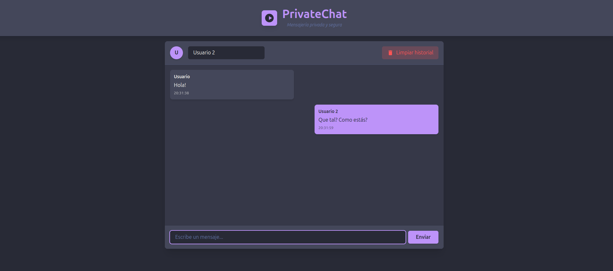

# PrivateChat 🔒

Una aplicación de chat minimalista construida con React y TypeScript, diseñada con una elegante paleta de colores Dracula. Permite la comunicación en tiempo real con una interfaz intuitiva y moderna.

## 🚀 Características

- Interfaz de usuario minimalista y elegante
- Diseño responsivo
- Tema Dracula integrado
- Gestión de usuarios simple
- Visualización de tiempo para cada mensaje
- Diferenciación visual entre mensajes propios y ajenos
- **¡Nuevo!** Función de limpieza de historial con confirmación modal
- **¡Nuevo!** Gestión de estado para mantener la privacidad

## 🛠️ Tecnologías Utilizadas

- **React 18**: Biblioteca principal para la construcción de la interfaz
- **TypeScript**: Superset de JavaScript para tipado estático
- **Vite**: Herramienta de construcción y desarrollo
- **Tailwind CSS**: Framework de CSS para el diseño
- **Nanoid**: Generación de IDs únicos
- **React Hooks**: Gestión del estado de la aplicación

## 📦 Instalación

1. Clona el repositorio:
```bash
git clone https://github.com/your-username/private-chat.git
cd private-chat
```

2. Instala las dependencias:
```bash
npm install
```

3. Inicia el servidor de desarrollo:
```bash
npm run dev
```

4. Abre tu navegador en `http://localhost:5173`

## 🔧 Configuración

### Requisitos Previos
- Node.js (versión 14 o superior)
- npm (versión 6 o superior)

### Variables de Entorno
Crea un archivo `.env` en la raíz del proyecto:
```env
VITE_APP_TITLE=PrivateChat
```

## 🎨 Paleta de Colores Dracula

```javascript
{
  background: '#282a36',
  current: '#44475a',
  foreground: '#f8f8f2',
  comment: '#6272a4',
  cyan: '#8be9fd',
  green: '#50fa7b',
  orange: '#ffb86c',
  pink: '#ff79c6',
  purple: '#bd93f9',
  red: '#ff5555',
  yellow: '#f1fa8c'
}
```

## 📁 Estructura del Proyecto

```
private-chat/
├── public/
│   └── favicon.svg
├── src/
│   ├── components/
│   │   └── App.tsx
│   ├── types/
│   │   └── index.ts
│   ├── main.tsx
│   └── index.css
├── index.html
├── package.json
├── tailwind.config.js
├── tsconfig.json
└── vite.config.ts
```

## 💻 Componentes Principales

### ChatApp
El componente principal que maneja:
- Gestión de mensajes
- Interfaz de usuario
- Entrada de mensajes
- Visualización de mensajes
- Limpieza de historial con confirmación modal

```typescript
interface Message {
    id: string;
    text: string;
    sender: string;
    timestamp: Date;
}
```

## 🔐 Funcionalidades de Privacidad

La aplicación incluye varias características centradas en la privacidad:

1. **Limpieza de Historial**
   - Botón dedicado para eliminar todo el historial de chat
   - Modal de confirmación para prevenir eliminaciones accidentales
   - El botón solo aparece cuando hay mensajes en el historial
   - Eliminación inmediata y completa de todos los mensajes

2. **Gestión de Sesión**
   - Los mensajes se mantienen solo en la memoria del navegador
   - No hay persistencia de datos entre sesiones
   - El historial se elimina al cerrar la aplicación

## 🔨 Scripts Disponibles

- `npm run dev`: Inicia el servidor de desarrollo
- `npm run build`: Construye la aplicación para producción
- `npm run preview`: Vista previa de la versión de producción
- `npm run lint`: Ejecuta el linter
- `npm run type-check`: Verifica los tipos de TypeScript

## 🚀 Despliegue

La aplicación puede ser desplegada en varias plataformas:

1. **Vercel** (Recomendado):
```bash
vercel
```

2. **Netlify**:
```bash
netlify deploy
```

## 🤝 Contribuir

1. Haz un Fork del proyecto
2. Crea una rama para tu característica (`git checkout -b feature/AmazingFeature`)
3. Commit tus cambios (`git commit -m 'Add some AmazingFeature'`)
4. Push a la rama (`git push origin feature/AmazingFeature`)
5. Abre un Pull Request

## 📝 Licencia

Este proyecto está bajo la Licencia MIT - ver el archivo [LICENSE.md](LICENSE.md) para más detalles

## 📸 Capturas de Pantalla


*Captura de pantalla de la aplicación PrivateChat en funcionamiento*

---
⌨️ con ❤️ por [espfrant](https://github.com/espfrant) 😊